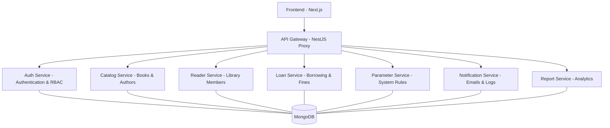

# 📚 Hệ thống Quản lý Thư viện (Library Management System - Microservices)

Dự án Hệ thống Quản lý Thư viện hiện đại được xây dựng trên kiến trúc **Microservices** mạnh mẽ, mang lại khả năng mở rộng tối đa và quản lý nghiệp vụ chuyên sâu cho các thư viện quy mô vừa và lớn.

---

## 🚀 Tính năng nổi bật
*   **Kiến trúc Microservices**: Decoupling hoàn toàn các thành phần (Auth, Catalog, Loan, Report...).
*   **Trình quản lý Tab thông minh**: Tự động gom nhóm toàn bộ dịch vụ vào Windows Terminal để dễ dàng kiểm soát.
*   **Bảo mật & Đồng bộ**: Cơ chế quản lý `.env` tập trung, đảm bảo tính nhất quán cho toàn bộ hệ thống.
*   **Triển khai linh hoạt**: Hỗ trợ cả chạy trực tiếp (Native PowerShell) và Docker Compose.

---

## 🏗 Kiến trúc hệ thống



---

## 🛠 Danh sách các Dịch vụ (Microservices)

| Dịch vụ | Chức năng chính | Port |
| :--- | :--- | :--- |
| **Frontend** | Giao diện Next.js 14, Responsive & Modern UI. | 3000 |
| **API Gateway** | Cổng điều hướng, Proxy tập trung. | 4000 |
| **Auth Service** | Quản lý người dùng, phân quyền JWT. | 4001 |
| **Catalog Service** | Quản lý sách, tác giả, thể loại. | 4002 |
| **Report Service** | Kết xuất báo cáo thống kê thư viện. | 4003 |
| **Notification** | Gửi Email & Nhật ký hoạt động. | 4004 |
| **Reader Service** | Quản lý độc giả & thẻ thành viên. | 4005 |
| **Loan Service** | Quy trình Mượn/Trả & Phí phạt. | 4006 |
| **Parameter** | Cấu hình quy định hệ thống. | 4007 |

---

## ⚡ Hướng dẫn Triển khai Phát triển (Development)

### 1. Cấu hình Biến môi trường
Dự án sử dụng các biến môi trường để bảo mật thông tin liên kết:
1.  **Tạo file gốc**: Sao chép file mẫu: `cp .env.example .env` và điền thông tin Database của bạn.
2.  **Đồng bộ hóa các service**: Vì mỗi Microservice chạy độc lập, chúng cần file `.env` riêng. Bạn có thể dùng lệnh sau để copy nhanh từ file gốc vào tất cả các thư mục:
    ```powershell
    Get-ChildItem -Directory | ForEach-Object { copy .env $_.FullName }
    ```
    *(Ghi chú: Script `start-all.ps1` cũng đã được tích hợp để tự động làm việc này cho bạn).*

### 2. Khởi chạy toàn dự án (One-Click Start)
Chúng tôi cung cấp script PowerShell thông minh để khởi chạy toàn bộ 9 dịch vụ:
```powershell
.\start-all.ps1
```
> [!IMPORTANT]
> **Windows Terminal**: Script sẽ ưu tiên mở toàn bộ dịch vụ trong **duy nhất 1 cửa sổ (9 Tab)** nếu máy bạn có cài Windows Terminal. Mỗi tab sẽ có màu sắc và tiêu đề riêng để bạn dễ quản lý.

### 3. Dừng hệ thống
Để tắt tất cả các cổng đang chạy và giải phóng RAM:
```powershell
.\stop-all.ps1
```

---

## 🐳 Triển khai bằng Docker
Dành cho việc chạy trong môi trường container:
```bash
docker-compose up -d --build
```
Dịch vụ sẽ khả dụng tại:
- **Frontend**: `http://localhost:3000`
- **Gateway**: `http://localhost:4000`

---

## 📂 Cấu trúc thư mục
- `/frontend`: Mã nguồn giao diện chính.
- `/gateway`: API Gateway (NestJS).
- `/*-service`: Các dịch vụ microservices độc lập.
- `start-all.ps1` / `stop-all.ps1`: Bộ công cụ điều khiển hệ thống.

---
# l i b r a r y - w e b s i t e - m i c r o s e r v i c e  

---

## ⚙️ Advanced CI/CD & GitOps (GitHub Actions + AWS + ArgoCD)

Hệ thống đã được nâng cấp lên kiến trúc CI/CD nâng cao, tách biệt quá trình tích hợp và triển khai (CI/CD separated).

### 🏗️ Cấu trúc Pipeline
1.  **CI ([ci.yml](.github/workflows/ci.yml))**:
    -   **Linting**: Đảm bảo chất lượng code cơ bản.
    -   **SonarQube**: Quét chất lượng và phân tích bảo mật mã nguồn chuyên sâu.
    -   **Trivy**: Quét lỗ hổng bảo mật cho Docker Images trước khi đẩy lên registry.
    -   **Docker Hub**: Đẩy images an toàn sau khi đã vượt qua các bước kiểm tra security.
2.  **CD ([cd.yml](.github/workflows/cd.yml))**:
    -   **Terraform**: Tự động hóa việc quản lý hạ tầng AWS (VPC, EKS Cluster).
    -   **ArgoCD (GitOps)**: Tự động cập nhật image tag trong manifests và đồng bộ hóa trạng thái cluster theo mô hình GitOps.

### 🛠️ Hạ tầng (Infrastructure as Code)
Mã nguồn hạ tầng nằm trong thư mục `/terraform`:
-   **VPC**: Thiết lập mạng private/public subnet cho cluster.
-   **EKS**: Managed Kubernetes cluster với managed node groups.
-   **ArgoCD**: Được triển khai tự động qua Helm để quản lý ứng dụng.

### 🚀 Quy trình GitOps
Hệ thống sử dụng thư mục `/k8s` làm "Source of Truth":
-   Pipeline CD sẽ tự động cập nhật tag image trong các file YAML tại `/k8s`.
-   **ArgoCD** giám sát repo và tự động thực hiện việc triển khai (`Sync`) lên EKS mà không cần can thiệp thủ công.

### 🔑 Các Secrets cần thiết
Vui lòng cấu hình các secrets sau trong GitHub Repository:
-   `SONAR_TOKEN` & `SONAR_HOST_URL` (Từ SonarQube/SonarCloud).
-   `AWS_ACCESS_KEY_ID` & `AWS_SECRET_ACCESS_KEY` (Quyền Administrator hoặc EKS/VPC permissions).
-   `DOCKERHUB_USERNAME` & `DOCKERHUB_TOKEN`.