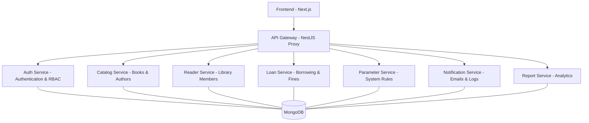

# 📚 Hệ thống Quản lý Thư viện (Library Management System - Microservices)

## 📌 Giới thiệu dự án
Dự án Hệ thống Quản lý Thư viện là một ứng dụng web hiện đại được xây dựng trên kiến trúc **Microservices**. Hệ thống được thiết kế để tối ưu hóa việc quản lý sách, độc giả, quy trình mượn trả và các báo cáo nghiệp vụ trong thư viện, đảm bảo khả năng mở rộng và bảo trì linh hoạt.

## 🏗 Kiến trúc hệ thống
Hệ thống bao gồm giao diện người dùng (Frontend), cổng kết nối tập trung (API Gateway) và các dịch vụ nghiệp vụ (Microservices) chạy độc lập, giao tiếp thông qua giao thức HTTP.



## 🛠 Danh sách các Dịch vụ (Microservices)

| Dịch vụ | Chức năng chính | Port |
| :--- | :--- | :--- |
| **Frontend** | Giao diện người dùng xây dựng bằng Next.js 14, responsive và hiện đại. | 3000 |
| **API Gateway** | Điểm tiếp nhận duy nhất, chịu trách nhiệm định tuyến request đến các microservice. | 4000 |
| **Auth Service** | Quản lý người dùng, phân quyền (Role-based Access Control), và xác thực JWT. | 4001 |
| **Catalog Service** | Quản lý danh mục sách, đầu sách, tác giả, thể loại và lưu trữ ảnh bìa. | 4002 |
| **Report Service** | Xử lý và kết xuất các báo cáo thống kê thư viện (Lượt mượn, sách quá hạn...). | 4003 |
| **Notification Service** | Gửi email thông báo cho độc giả và lưu vết hoạt động hệ thống (Audit logs). | 4004 |
| **Reader Service** | Quản lý thông tin chi tiết độc giả, loại độc giả và gia hạn thẻ. | 4005 |
| **Loan Service** | Xử lý quy trình Mượn/Trả sách, kiểm tra ràng buộc và tính phí phạt trễ hạn. | 4006 |
| **Parameter Service** | Cấu hình các quy định chung (Số sách tối đa, mức phạt, tuổi độc giả...). | 4007 |

## 🚀 Hướng dẫn Triển khai (Deployment)

### Yêu cầu hệ thống
- [Docker](https://www.docker.com/) & [Docker Compose](https://docs.docker.com/compose/)
- [Node.js](https://nodejs.org/) (Nếu chạy ngoài Docker)

### Triển khai nhanh bằng Docker Compose (Khuyên dùng)
Đây là phương pháp ổn định nhất để chạy toàn bộ hệ thống cùng với cơ sở dữ liệu MongoDB Atlas.

1. **Cài đặt Biến môi trường**:
   - Sao chép tệp mẫu: `cp .env.example .env` (hoặc copy-paste và đổi tên trên Windows).
   - Mở tệp `.env` và điền các thông tin quan trọng như `MONGODB_URI`, `JWT_SECRET`, và cấu hình `MAIL`.
2. Mở Terminal tại thư mục gốc và chạy lệnh:
   ```bash
   docker-compose up -d --build
   ```
3. Chờ Docker build và khởi động các container. Bạn có thể truy cập:
   - **Frontend**: `http://localhost:3000`
   - **API Gateway**: `http://localhost:4000`
4. Để dừng hệ thống:
   ```bash
   docker-compose down
   ```

### Chạy bằng Script PowerShell (Dành cho Windows)
Nếu bạn muốn chạy từng dịch vụ trong các cửa sổ terminal riêng biệt để phát triển (Dev):
1. Chạy PowerShell với quyền Admin.
2. Chạy script: `.\start-all.ps1`

## 🔐 Bảo mật và Cấu hình (Environment Variables)

Dự án sử dụng các biến môi trường để quản lý cấu hình nhạy cảm. **Không bao giờ** commit tệp `.env` thực tế lên kho lưu trữ.

Các khóa chính cần cấu hình:
- `MONGODB_URI`: Chuỗi kết nối tới MongoDB (Atlas hoặc Local).
- `JWT_SECRET`: Khóa bí mật dùng để ký và xác thực mã JWT.
- `MAIL_USER` / `MAIL_PASS`: Tài khoản email dùng để gửi thông báo.

Tham khảo tệp [.env.example](.env.example) để biết danh sách đầy đủ.

## 📂 Cấu trúc dự án
- `/frontend`: Mã nguồn giao diện chính (Next.js).
- `/gateway`: NestJS Proxy Gateway (Cổng điều hướng).
- `/auth-service`: Dịch vụ xác thực và phân quyền.
- `/catalog-service`: Quản lý kho sách và tác giả.
- `/reader-service`: Quản lý thông tin thành viên.
- `/loan-service`: Quản lý phiếu mượn và phí phạt.
- `/parameter-service`: Quản lý tham số và quy định.
- `/notification-service`: Xử lý thông báo và nhật ký.
- `/report-service`: Xử lý báo cáo thống kê.
- `docker-compose.yml`: Cấu hình container toàn hệ thống.

---
> [!IMPORTANT]
> Toàn bộ các yêu cầu từ Frontend đều phải đi qua **API Gateway (Port 4000)** để được xác thực và định tuyến đúng dịch vụ đích. Không nên gọi trực tiếp đến các port của microservice từ phía Client.