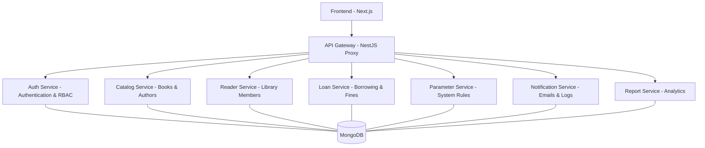

# 📚 Hệ thống Quản lý Thư viện (Library Management System - Microservices)

Dự án Hệ thống Quản lý Thư viện hiện đại được xây dựng trên kiến trúc **Microservices** mạnh mẽ, mang lại khả năng mở rộng tối đa và quản lý nghiệp vụ chuyên sâu cho các thư viện quy mô vừa và lớn.

---

## 🚀 Tính năng nổi bật
*   **Kiến trúc Microservices**: Decoupling hoàn toàn các thành phần (Auth, Catalog, Loan, Report...).
*   **Trình quản lý Tab thông minh**: Tự động gom nhóm toàn bộ dịch vụ vào Windows Terminal để dễ dàng kiểm soát.
*   **Bảo mật & Đồng bộ**: Cơ chế quản lý `.env` tập trung, đảm bảo tính nhất quán cho toàn bộ hệ thống.
*   **Triển khai linh hoạt**: Hỗ trợ cả chạy trực tiếp (Native PowerShell) và Docker Compose.

---

## 🏗 Kiến trúc hệ thống



---

## 🛠 Danh sách các Dịch vụ (Microservices)

| Dịch vụ | Chức năng chính | Port |
| :--- | :--- | :--- |
| **Frontend** | Giao diện Next.js 14, Responsive & Modern UI. | 3000 |
| **API Gateway** | Cổng điều hướng, Proxy tập trung. | 4000 |
| **Auth Service** | Quản lý người dùng, phân quyền JWT. | 4001 |
| **Catalog Service** | Quản lý sách, tác giả, thể loại. | 4002 |
| **Report Service** | Kết xuất báo cáo thống kê thư viện. | 4003 |
| **Notification** | Gửi Email & Nhật ký hoạt động. | 4004 |
| **Reader Service** | Quản lý độc giả & thẻ thành viên. | 4005 |
| **Loan Service** | Quy trình Mượn/Trả & Phí phạt. | 4006 |
| **Parameter** | Cấu hình quy định hệ thống. | 4007 |

---

## ⚡ Hướng dẫn Triển khai Phát triển (Development)

### 1. Cấu hình Biến môi trường
Dự án sử dụng các biến môi trường để bảo mật thông tin liên kết:
1.  **Sao chép file mẫu**: Chạy lệnh `cp .env.example .env` (hoặc copy-paste tay).
2.  **Cấu hình Database**: Mở file `.env` và điền `MONGODB_URI` (đã được đồng bộ hóa trên toàn bộ hệ thống).
3.  **JWT Secret**: Mặc định là `lght` để kiểm tra nhanh.

### 2. Khởi chạy toàn dự án (One-Click Start)
Chúng tôi cung cấp script PowerShell thông minh để khởi chạy toàn bộ 9 dịch vụ:
```powershell
.\start-all.ps1
```
> [!IMPORTANT]
> **Windows Terminal**: Script sẽ ưu tiên mở toàn bộ dịch vụ trong **duy nhất 1 cửa sổ (9 Tab)** nếu máy bạn có cài Windows Terminal. Mỗi tab sẽ có màu sắc và tiêu đề riêng để bạn dễ quản lý.

### 3. Dừng hệ thống
Để tắt tất cả các cổng đang chạy và giải phóng RAM:
```powershell
.\stop-all.ps1
```

---

## 🐳 Triển khai bằng Docker
Dành cho việc chạy trong môi trường container:
```bash
docker-compose up -d --build
```
Dịch vụ sẽ khả dụng tại:
- **Frontend**: `http://localhost:3000`
- **Gateway**: `http://localhost:4000`

---

## 📂 Cấu trúc thư mục
- `/frontend`: Mã nguồn giao diện chính.
- `/gateway`: API Gateway (NestJS).
- `/*-service`: Các dịch vụ microservices độc lập.
- `start-all.ps1` / `stop-all.ps1`: Bộ công cụ điều khiển hệ thống.

---
# l i b r a r y - w e b s i t e - m i c r o s e r v i c e  